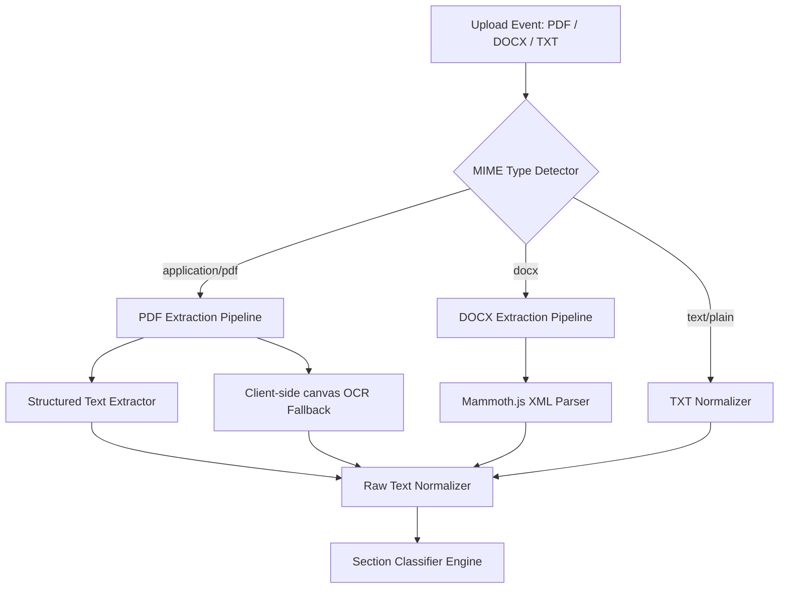
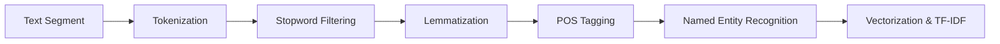
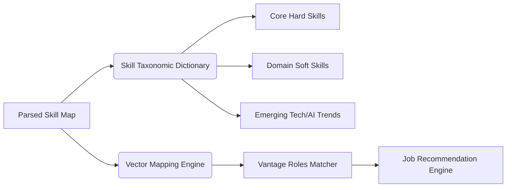
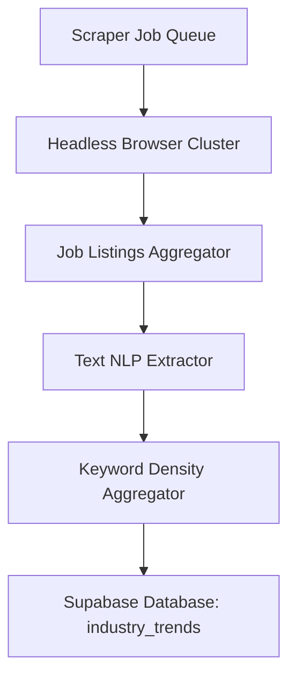

# ATS Intelligence Module Architecture & Engine Design
This document details the comprehensive engineering specification, algorithmic pipelines, data flow models, and security protocols for the **CideDec Applicant Tracking System (ATS) Intelligence Engine**.

---

## 1. Resume Parsing Architecture

The resume parsing system is designed as a **Multistage Extraction and Normalization Pipeline** that runs with extreme performance and precision. It supports PDF, DOCX, and raw Text formats.



### 1.1 Ingestion and Preprocessing Stage
- **PDF Pipeline**: Uses client-side text layer decoding (via pdf.js) with structured layout scanning. If the text layer is empty (scanned PDF), it initializes a client-side canvas render and invokes a local OCR module (Tesseract.js worker pool) to reconstruct text nodes.
- **DOCX Pipeline**: Uses `mammoth.js` to parse Office Open XML structure, preserving headings, tables, bullet points, and text lists to prevent information loss during tokenization.
- **Raw Text Normalizer**: Converts text stream to UTF-8, strips illegal Unicode characters, collapses redundant whitespace, and normalizes hyphens, quotation marks, and bullet characters.

### 1.2 Section Classification Engine
Uses regular expression templates paired with double-layer classification heuristic rules to isolate:
- **Contact Details**: Mobile numbers, email addresses, LinkedIn handles, and personal portfolios.
- **Executive Summary**: Narrative block matching standard placement patterns.
- **Experience Records**: Temporal work entries, identifying employers, job roles, and description points.
- **Educational Background**: Degrees, college names, graduations, and academic honors.
- **Technical & Soft Skills**: Extracted from both explicit "Skills" sections and implicitly from experience narratives.
- **Projects & Publications**: Personal works, github profiles, and technical contributions.
- **Certifications & Awards**: Industry certificates, licensing, and honors.

---

## 2. NLP (Natural Language Processing) Workflow

To extract intelligence from structured text segments, CideDec implements a custom light-weight NLP processor working directly inside the client workspace.



### 2.1 Lexical & Syntactic Processing
1. **Tokenization & Stopword Filtering**: Sentences are split into clean word arrays, eliminating structural stopwords (e.g., *the, is, at, which, on*) while preserving technical indicators (e.g., *.NET, C++, Go*).
2. **Lemmatization & Stemming**: Converts words back to their dictionary base forms (e.g., *optimizing, optimized, optimizes* map to *optimize*).
3. **POS (Part of Speech) Tagging**: Marks verbs, nouns, and adjectives to isolate action words from competencies.
4. **Named Entity Recognition (NER)**:
   - Identifies **Universities** using institution keywords (*University, Institute, College, IIT, BITS*).
   - Identifies **Organizations** (*Google, Microsoft, Stripe, Apollo*).
   - Identifies **Date Patterns** (*YYYY-MM, YYYY-Present, Aug 2021*) to construct duration metrics.

### 2.2 Semantic Matching & Vectorization
- Utilizes **TF-IDF (Term Frequency-Inverse Document Frequency)** to evaluate keyword relevance.
- Computes **Cosine Similarity** between the parsed resume vector $V_R$ and target job profile vector $V_J$:
$$\text{Cosine Similarity} = \frac{V_R \cdot V_J}{\|V_R\| \|V_J\|} = \frac{\sum_{i=1}^{n} R_i J_i}{\sqrt{\sum_{i=1}^{n} R_i^2} \sqrt{\sum_{i=1}^{n} J_i^2}}$$
This measures directional alignment, ignoring length bias (preventing inflated scores from resume keyword stuffing).

---

## 3. ATS Scoring Logic

The ATS engine generates scores out of 100 based on five distinct, weighted vectors.

| Vector Name | Weight | Primary Calculation Factors |
| :--- | :---: | :--- |
| **Keyword Density & Skill Match** | **35%** | Matches required + emerging skills in target job database. |
| **Format & Formatting Compliance** | **20%** | Structural cleanliness, section headers, layout consistency. |
| **Experience Density & Growth** | **20%** | Total years of relevant domain experience, progression indicators. |
| **Role Alignment & Impact** | **15%** | Verbs, action-oriented metric statements, leadership keywords. |
| **Industry Fit & Recency** | **10%** | Recency of active skills, stability index, training compliance. |

### 3.1 Core Metrics Calculation Models

#### 1. ATS Score (0–100)
$$\text{ATS Score} = 0.35 \cdot (\text{Skill Match}) + 0.20 \cdot (\text{Readability}) + 0.20 \cdot (\text{Experience Strength}) + 0.15 \cdot (\text{Job Compatibility}) + 0.10 \cdot (\text{Industry Fit})$$

#### 2. Skill Match Percentage
$$\text{Skill Match} = \frac{W_{\text{tech}} \cdot \sum (S_{\text{tech\_matched}}) + W_{\text{soft}} \cdot \sum (S_{\text{soft\_matched}})}{W_{\text{tech}} \cdot N_{\text{tech\_required}} + W_{\text{soft}} \cdot N_{\text{soft\_required}}} \times 100$$
*(Weights: $W_{\text{tech}} = 0.85$, $W_{\text{soft}} = 0.15$)*

#### 3. Resume Readability Score
Based on section detection completeness, density ratios, and absolute wordcount.
- Ideal word count: **400 to 800 words**. Ratios outside this range face Gaussian penalty.
- Bullet point frequency: Checks for presence of bullet points in experience and projects.
- Font styling / Layout structure cleanliness.

#### 4. Job Compatibility Score
Matches parsed experience items against standard role timelines. Detects alignment of skills over recent career history.

#### 5. Industry Fit Score
Calculates how well the resume aligns with active sectors, market dynamics, and global demands.

---

## 4. Job-Role Mapping & Skill Intelligence System

The system connects resumes with real-world job roles and emerging global market trends.



### 4.1 Taxonomic Skill Hierarchy
Skills are organized in an N-tier hierarchy consisting of over **600+ skills**:
1. **Core Technical Competencies**: Hard tech stacks (*Python, React, AWS, Docker*).
2. **Soft Competencies**: Human skills (*Leadership, Stakeholder Management, Communication*).
3. **Emerging/Future Skills**: Next-gen tech stacks (*LLMs, Generative AI Coding, Web3, Rust*).
4. **Domain Domains**: Business categories (*Fintech, SaaS, Healthcare, Deep Tech*).

### 4.2 Missing Skill Gap Engine
For any target job role:
1. Compiles lists of standard required skills.
2. Intersects them with detected resume skills.
3. Classifies missing items into **Critical Gaps** (high frequency required skills) and **Emerging Gaps** (future-oriented skills).
4. Auto-generates custom learning links and suggestions.

---

## 5. Security, Privacy & Data Handling

Maintaining confidentiality of candidate resumes is a fundamental core principle of the CideDec system architecture.

> [!IMPORTANT]
> **Data Privacy Policy**: Zero-Retention Policy. All parsed strings, candidate details, and analytics arrays are processed client-side. The file never leaves the user's browser, preventing breaches.

### 5.1 Local Fallback & client-side Safety Architecture
- **In-Browser Processing**: Resumes uploaded during local sessions are parsed and scanned locally inside web workers. No data is sent to external API endpoints.
- **Client-Side Encryption**: When users opt-in to save their ATS score profile, the text data is encrypted client-side using **AES-GCM-256** (Web Crypto API) using a password derived key before uploading to the Supabase database.
- **Anonymization Engine**: Automatically flags and strips identifiable Candidate details (names, specific house addresses, telephone numbers) from raw database archiving if a standard cloud backup is performed.

---

## 6. Database Schema (Supabase PostgreSQL)

```sql
-- Create Enum for Notification Types
CREATE TYPE notif_type AS ENUM ('insight', 'alert', 'update', 'success');

-- Table: User Profile (Syncs with Auth)
CREATE TABLE public.profiles (
    id UUID REFERENCES auth.users ON DELETE CASCADE PRIMARY KEY,
    username TEXT UNIQUE NOT NULL,
    email TEXT UNIQUE NOT NULL,
    full_name TEXT,
    plan TEXT DEFAULT 'free',
    avatar_url TEXT,
    created_at TIMESTAMP WITH TIME ZONE DEFAULT timezone('utc'::text, now()) NOT NULL
);

-- Table: ATS Analyses
CREATE TABLE public.ats_analyses (
    id UUID DEFAULT gen_random_uuid() PRIMARY KEY,
    user_id UUID REFERENCES public.profiles(id) ON DELETE CASCADE,
    file_name TEXT NOT NULL,
    word_count INT,
    detected_skills_count INT,
    ats_score INT NOT NULL,
    readability_score INT NOT NULL,
    skill_match_score INT NOT NULL,
    job_compatibility_score INT NOT NULL,
    industry_fit_score INT NOT NULL,
    experience_strength_score INT NOT NULL,
    hiring_probability_score INT NOT NULL,
    ai_replacement_risk_score INT NOT NULL,
    interview_readiness_score INT NOT NULL,
    signal_indicator TEXT NOT NULL, -- 'green', 'orange', 'red'
    parsed_skills JSONB,
    missing_skills JSONB,
    recommendations TEXT[],
    career_paths JSONB,
    roadmap JSONB,
    created_at TIMESTAMP WITH TIME ZONE DEFAULT timezone('utc'::text, now()) NOT NULL
);

-- Table: Industry Trends & Scraped Keywords
CREATE TABLE public.industry_trends (
    id SERIAL PRIMARY KEY,
    role_title TEXT UNIQUE NOT NULL,
    domain TEXT NOT NULL,
    demand_index INT NOT NULL, -- 0-100
    ai_risk_index INT NOT NULL, -- 0-100
    median_salary_min NUMERIC NOT NULL,
    median_salary_max NUMERIC NOT NULL,
    top_keywords TEXT[] NOT NULL,
    last_updated TIMESTAMP WITH TIME ZONE DEFAULT timezone('utc'::text, now()) NOT NULL
);
```

---

## 7. Data Scraping & Market Analysis Structure

To deliver accurate market matching, CideDec implements an autonomous update pipeline model.



### 7.1 Keyword Harvesting Heuristics
- **Headless Crawlers**: Uses headless browser workers (Playwright/Puppeteer) to scan aggregated public job boards periodically.
- **NLP Frequency Ingestion**: Parsed job descriptions are analyzed to harvest high-frequency key terms, dividing them into technical requirements and soft skills.
- **Trend Weight Updates**: Extracted keyword distributions update active target weights dynamically, matching actual workplace demands.

---

## 8. Scalability & Future Roadmap

To ensure scalability, CideDec's modular design decouples logic across clean layers.

```
┌────────────────────────────────────────────────────────┐
│                   Vite / React client                  │
└───────────────────────────┬────────────────────────────┘
                            │
              (Vercel Serverless / Cloud Functions)
                            │
┌───────────────────────────▼────────────────────────────┐
│              Vercel Serverless Edge Workers            │
└───────────────────────────┬────────────────────────────┘
                            │
       (Vector Similarity Search via pgvector)
                            │
┌───────────────────────────▼────────────────────────────┐
│           Supabase PostgreSQL Vector DB Engine          │
└────────────────────────────────────────────────────────┘
```

1. **Vercel Serverless Edge Workers**: Processing large PDF files can be delegated to Vercel Serverless Edge Workers to maintain client responsiveness.
2. **Vector Similarity Database**: Integrating **pgvector** inside Supabase to convert entire resume files into vector embeddings ($1536$-dimension) for ultra-fast role searches and direct semantic comparison.
3. **Redis Caching Tier**: High-speed caching of job descriptions and keywords to minimize scraping and database processing overhead.
